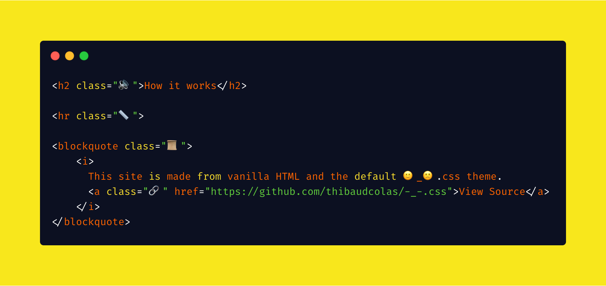

# [🙂_🙁.css](https://thibaudcolas.github.io/-_-.css/)

A mood-driven CSS framework to write modern websites using only emojis 🎉 

No complicated classes to remember, and much less typing than traditional verbose methodologies like BEM. Impossibly fast – emojis are only a few bytes each, name mangling out of the box.

> 🚀 [View the demo](https://thibaudcolas.github.io/-_-.css/)



## Usage

```css
.\⌨️ {
	/* Makes the ⌨️ element look like a keyboard key */
    border-radius: 4px;
	padding: 3px 6px;
	font-size: 0.9rem;
}

.\📋 {
	padding: 1rem 1.4rem;
	max-width: 100%;
	overflow: auto;
}

.\📋 .\📟 {
	/* When 📟 is in a 📋, reset it's formatting to blend in */
	background: inherit;
	font-size: inherit;
	color: inherit;
	border: 0;
	padding: 0;
	margin: 0;
}

.\📏 {
	/* Reset the border of the 📏 separator, then set a better line */
	border: 0;
	border-bottom: 1px solid currentColor;
	margin: 1rem auto;
}
```
